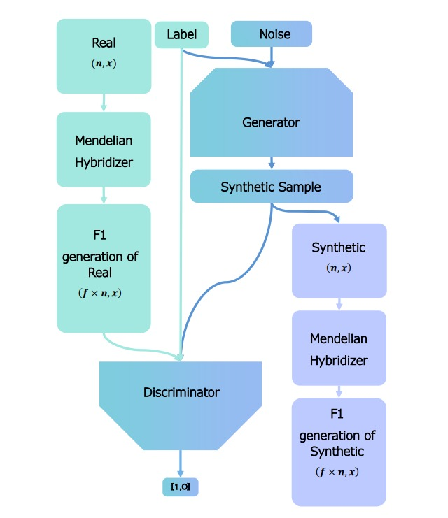

# Offspring_GAN
## This repository includes 1. code for offspring GAN 2. code for evaluation of synthetic data from offspring GAN 3. PCA plots for synthetic data generated by 3 diffferent GAN models. 3. code for requesting GPU node for interactive use.
 
## Abstract 
Genomics data have been used for disease phenotype prediction in
precision medicine for a long time. In recent years, many such prediction
models are built using machine Learning (ML) algorithms.
As of today, Genomic data and other biomedical data suffers from
sampling bias in terms of peoples’ ethnicity as most data comes
from people of European ancestry. A smaller sample size for other
population groups can cause suboptimal results in ML-based prediction
models for those populations. Suboptimal predictions in
precision medicine for some particular group can cause serious
consequences limiting models applicability in real world problems.
As data collection for those populations is time-consuming and
costly, we suggest Deep Learning-based models for in-silico data
enhancement. Existing GAN models for genomic data like Popu-
lation scale Genomic conditional-GAN (PG-cGAN) can generate
realistic genomic data while trained on fairly unbiased data, but fails
while trained on biased data and encounters severe mode collapse.
Our proposed model Offspring- Generative Adversarial Network
(Offspring GAN) can resolve the mode collapse issue even when
trained in strongly biased genomic datasets.We compare synthetic
data generated by both of the model to benchmark our model with
pre-existing PG-cGAN model. Our results show the ability of Off-
spring GAN to generate aware realistic and diverse data which can
be augmented with real data to alleviate the data bias. We also pro-
pose a privacy-preserving protocol using Offspring GAN to protect
the privacy of real data for respective lab.

## Offspring GAN architecture
|-------------------------|-------------------------| 
|  | <p> Real data is passed
through the Mendelian hybridizer, and it generates genotypes offspring generation,
which is passed to the discriminator as real data.
On the other hand, the generator takes an input of a conditional
label (which determines the ethnicity) and a noise vector and gener-
ates a synthetic genotype for the respective ethnicity. After training
generator is capable of label-aware realistic data generation, which
is passed to a second Mendelian hybridizer, and it can produce 𝐹1 generation genotype
of synthetic data with a lower computational
cost than the generator itself.</p>|

## Implications 
1. Data augmentation on heavily biased genomic dataset
2. Privacy Preserving protocol using Offspring genotype

## Getting started 
Codes are provided in ipython notebook files with instruction added in markdown text. 
1. One can get started by downloading the same and running in google collab.
2. For running in local devices you can follow theses steps:

First: Create virtual environment
```
git clone https://github.com/shilab/PG-cGAN.git
cd PG-cGAN
mkdir venv
python3 -m venv venv/
source venv/bin/activate
```
Second: Install requirment dependents
```
pip install tensorflow sklearn pandas jupyter matplotlib seaborn plotly
```

For running on HPC in interactive manner one can request GPU node as given in HPC_GPU.sh file in code folder. 
